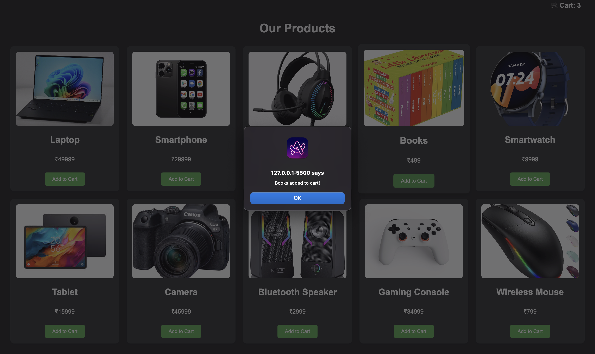

# 🛍️ TechieCart - Product Catalog

A simple, interactive product catalog for tech products built with HTML, CSS, and JavaScript.

## 📱 Preview

### Light Mode


### Dark Mode

---

## 📋 Table of Contents

- [Features](#features)  
- [Installation](#installation)  
- [Project Structure](#project-structure)  
- [Technologies Used](#technologies-used)  

---

## ✨ Features

- **Dynamic Product Display**: Products are displayed dynamically using JavaScript, allowing for easy updates and scalability.  
- **Add to Cart Functionality**: Users can add products to their cart, enhancing the shopping experience.  
- **Responsive Design**: The layout is responsive, ensuring compatibility across various devices and screen sizes.  
- **Visual Effects**: Interactive visual effects enhance user engagement and provide a modern look and feel.

---

## 🛠 Installation

1. **Clone the repository**:

   ```bash
   git clone https://github.com/Vidhi2004/Product-Catalog-.git
   ```

2. **Navigate to the project directory**:

   ```bash
   cd Product-Catalog-
   ```

3. **Open `index.html` in your preferred web browser**:

   You can simply double-click the `index.html` file, or use a Live Server extension in VS Code for live reloading.

---

## 📂 Project Structure

```
Product-Catalog-/
├── index.html       # Main HTML file
├── styles.css       # Styling for the application
├── script.js        # JavaScript functionality
```

---

## 🧰 Technologies Used

- **HTML5**: Markup language for structuring the web content.  
- **CSS3**: Styling language for designing the application.  
- **JavaScript**: Programming language to add interactivity and dynamic behavior.

---